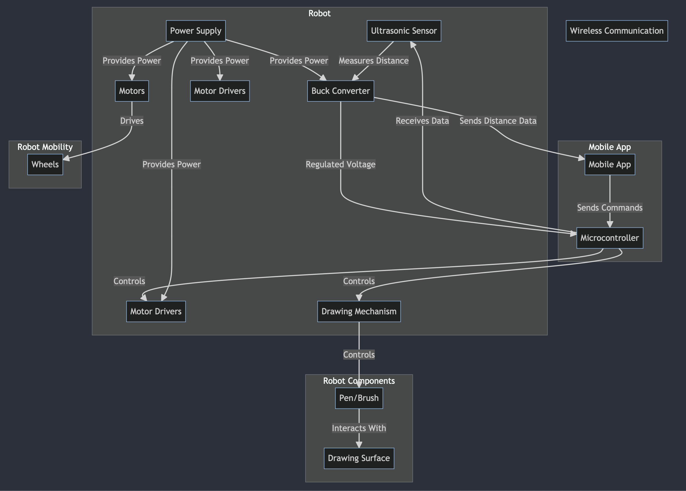

# ArtWheels

ArtWheels is a RISC-V VSD Squadron board based robotic platform designed for art enthusiasts, makers, and educators. This versatile robot can be controlled via Bluetooth from a mobile app, allowing you to create intricate drawings and patterns on surfaces.

- ### Compilation logs: 
    - #### Text log:
        - [ArduinoUNO Compiled Output](Compiled%20logs/TextFiles/ArduinoUNO_compiled_log.txt)
        - [RISCDUINO Compiled Output](CompilationLogs/TextFiles/Riscduino_compiled_log.txt) 
    - #### Snapshots:
        - Compiled Output for Arduino UNO board:
        

        - Compiled output for Riscduino Board:
         

---

## Table of Contents

- [Features](#features)
- [Product Idea](#product-idea)
- [Block Diagram](#block-diagram)
- [Hardware Requirements](#hardware-requirements)
- [Software Requirements](#software-requirements)
- [Mobile App Control](#mobile-app-control)
- [Custom Commands](#custom-commands)
- [License](#license)

---

## Features

- Remote control via a mobile app.
    - Joystick mode
    - Mobile Gyro Sensor mode
- Precise servo motor for drawing and design.
- Customizable drawing patterns.
- Distance sensing for added safety during operation.
- Extensive customization options for both hardware and software.

## Product Idea

ArtWheels is designed to perform the following functions:
- Draw: Create intricate drawings and patterns.
- Move: Navigate and explore its environment.
- Turn: Change direction.
- Adjust: Modify its servo angle.
- Communicate: Perform duplex mode of communication via Bluetooth from and to a mobile app.

## Block Diagram

## Hardware Requirements

To build your own ArtWheels robot, you'll need the following components:

- RISC V board (e.g., VSD Squadron)
- Motor driver module (L293D preferably)
- Ultrasonic sensor (HC-SR04)
- Servo motor
- Bluetooth module (HC-05)
- Chassis and wheels
- 2 x 18650 Li-ion batteries
- 18650 Lithium Battery Shield

### Software Requirements

Make sure you have the following software tools installed:

- Arduino IDE
- Mobile app (compatible with Android and iOS) for Bluetooth control
- [Riscduino Firmware](https://github.com/dineshannayya/riscduino_firmware) for specific sensor and motor control.

### Mobile App Control

1. Connect your mobile device to the ArtWheels robot via Bluetooth.
2. Use the app's intuitive interface to control the robot's movements and drawing patterns.
3. Choose your mode of preference either Joystick or Sensor mode. In sensor mode you can operate the bot with your hands. So basically, it's like drawing on surfaces with the use of the sensors in your mobile!

### Custom Commands

You can create custom commands and patterns for ArtWheels by modifying the code. This will be the future implementation!

## License

This project is licensed under the MIT License - see the [LICENSE](Docs/LICENSE) file for details.

---

Happy artistry with ArtWheels!
